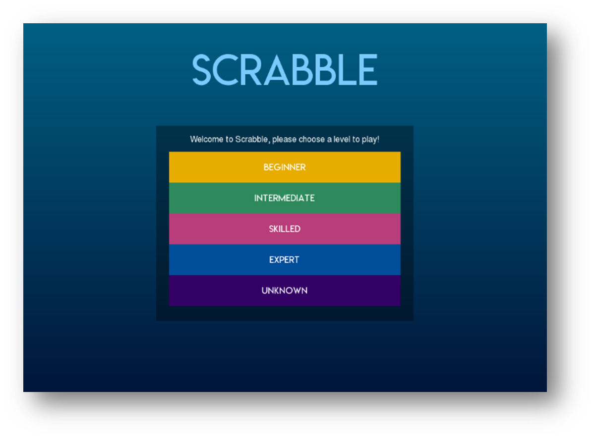
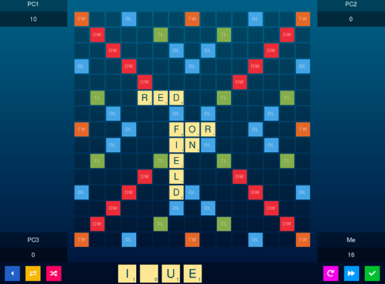

# Scrabble Game (School Project)
- Simple scrabble game based on Regular Expression
- Written in C++, SDL2
- Turn-based game

# Features
- Different difficulty: Beginner, Intermediate, Skilled, Expert, Uknown
- Exchange tiles
- Shuffle tiles
- Pass

# Screenshots

